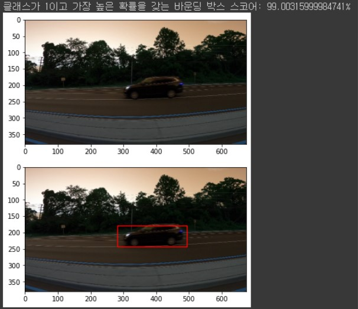

# RCNN을 이용한 차량 객체 탐지

## RCNN(Region-based Convolutional Neural Network)이란
* CNN과 region proposal 알고리즘을 연결하여 객체 탐지를 수행하는 two-stage 객체 탐지 아키텍쳐
* CNN을 이용하여 이미지 분류를 수행
* region proposal을 이용하여 이미지 내 객체(objects)의 위치를 표시(localization)  

## 프로젝트 가설 설정
* RCNN으로 실제 자율주행 시스템에서 사용가능한 차량 객체 탐지 모델을 학습할 수 있을 것
### 

## 데이터셋
* 차량 외 다른 객체가 거의 없는 데이터셋으로, 차량 객체 탐지 모델을 학습하기에 적합
* 다른 객체가 없어 모델 성능이 잘 나오므로, 다른 객체를 많이 포함하는 이미지 데이터셋으로 학습한 모델에 대해 해당 모델을 비교 대상으로 이용가능
### 

## 모델 구조
* 사전 학습 모델: VGG16(imagenet 데이터로 학습)
* selectvie search: 2000개의 region proposal을 뽑음
* CNN: 앞에서 나온 region들에 대해, 즉 2000번 만큼 CNN을 수행. 여기에서 특성 벡터를 추출
* SVM: 추출된 특성 벡터를 기반으로 분류기 학습
###

## 실험 결과

* 실제 자율주행 차량에서 사용가능한 정확도 확보
* 하지만 객체 탐지 속도가 느림. 이는 selective search를 통해 찾은 2천 개의 영역에 모두 CNN을 이용한 추론(inference)이 진행되기 때문
* 정확도 뿐만 아니라 객체 탐지 속도가 중요한 자율주행 내에서는 사용되기 어려울 것으로 보임

## 개선점
* 외국 차량 이미지 데이터가 아니라, 한국 내 데이터를 구해서 학습 및 테스트
* 다른 객체가 많이 포함된 데이터를 이용해서 학습 및 테스트
