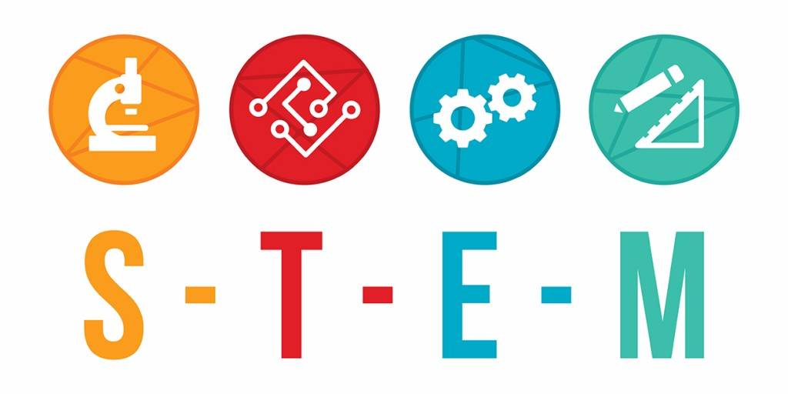

# STEM 직군 연봉 예측 머신러닝 프로젝트  

* STEM: Science, Tech, Engineering, Math의 앞글자를 딴 말로, 일반적으로 이공계를 의미
* 프로젝트 가설 설정
  * 한국 IT 기업이 기업 문화나 여러 측면에서 영향을 많이 받는 실리콘 밸리 기업의 개발자나 STEM 직군 종사자들의 연봉을 분석함으로써 최근 한국 내 STEM 직군 종사자들의 연봉이 오르는 현상, 또 거기에 영향을 미치는 요인이 무엇인지 등에 대해서도 통찰을 얻을 수 있을 것
   * IT 업계에서는 이직이 잦은데 이직 이유 중 연봉이 차지하는 비중이 큼(https://www.apollotechnical.com/career-change-statistics/). 이에 대해 검색을 해보는 경우가 많은데, 실제 연봉 데이터를 기반으로 API 서비스를 개발하여 회사 이름과 직책, 직군 등 조건을 입력함에 따라 연봉을 예측해주는 앱을 만든다면, 간단하더라도 많은 STEM 직군 종사자들이 이용할 것

## 이전까지 진행 상황(2022/01에 수행)
* levels.fyi의 연봉 데이터를 이용(참고: https://towardsdatascience.com/a-beginners-guide-to-grabbing-and-analyzing-salary-data-in-python-e8c60eab186e), colab에서 진행
* 시각화
* 전처리
  * 
* 특성공학
* 머신러닝 알고리즘 적용
  * 선형 회귀
  * 릿지 회귀
  * xg부스트
  * 랜덤포레스트
* 결과 시각화

## 수정/보완 방향(2022/05 이후)
* [x] README 추가
* [x] 데이터를 requests 이용 가져오기
* [ ] 데이터를 DB에 저장
* [ ] 대시보드 이용 데이터 시각화 추가
* [ ] 리팩터링
